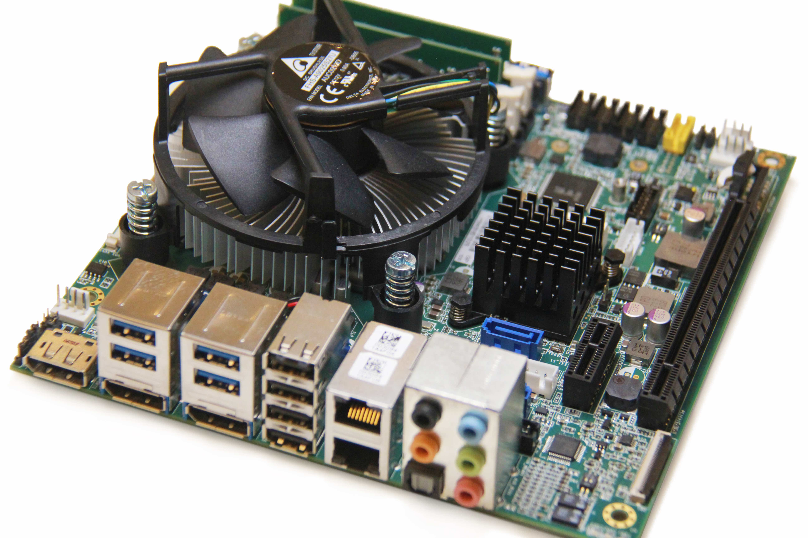

# Welcome to ADLINK Neuron's Documents

## Why Neuron ?

ADLINK Technology's industrial-grade ROS development kit, Neuron, boasts the characteristic in which the CPU can be change according to requirements, and has a wide variety of I/O pins. 

Neuron also could integrate GPU for supporting the AI computing platforms, which brings about great acceleration for robot computation to meet your needs for robot applications. Moreover, Neuron is compatible with ROS2, allowing to control the robot through the ROS2 application library with rich open source, such as cameras, navigation, and motion control, so that you can develop the application within the shortest possible time and reduce time to market.
